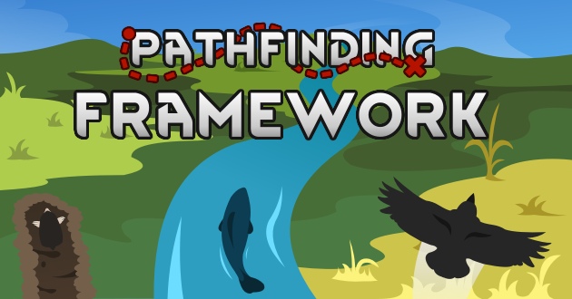

Pathfinding Framework
===

   

Ever wished your colonists in [RimWorld](https://rimworldgame.com/) could do more than just walk? With the [Pathfinding Framework](https://steamcommunity.com/sharedfiles/filedetails/?id=3070914628) mod, they can! The mod introduces a variety of new movement types, allowing pawns to move across the world in entirely new ways.

You only need to add this mod to your mod list, along with any other mods of your choice that have support for this framework (such as for example mods in the Biomes! series). Pathfinding Framework will then automatically assign appropriate movement types to pawns based on their characteristics, apparel, and other factors.

**Discord server:** https://discord.gg/HB3KyzStgp

### Features

* **Diverse movement types:** Introduces a variety of movement types, including aquatic, flying and digging.

* **Terrain interaction:** Pawns intelligently interact with terrains based on their movement type. Watch as birds effortlessly fly over obstacles or fish navigate through deep waters.

* **Extensible framework:** Mod authors can patch movement type support for their pawns, apparel, genes or other items, or even define custom movement types. Check the [Modding wiki](https://github.com/joseasoler/Pathfinding-Framework/wiki/Modding) for details.

* **Compatible and performance-friendly:** Designed to play well with other mods and optimized for smooth gameplay.

### Frequenty Asked Questions (FAQ)

**Can I safely add this mod to an existing save?**

Yes.

**Can I safely remove this mod from an existing save?**

No.

**How can I make humans walk over deep water?**

Go to Options > Mod Settings > Pathfinding Framework. Choose the Pawn Movements tab. Scroll to the end until you see the Human entry. Click on the Terrestrial button and set it to Swimming.

**Where should I place Pathfinding Framework in my mod list load order?**

As long as the mod does not trigger any load order warnings, it will work fine. Using [RimSort](https://github.com/oceancabbage/RimSort) or [RimPy](https://github.com/rimpy-custom/RimPy/releases) to sort your list should always give optimal results.

**Is this mod compatible with...**

Pathfinding Framework should be compatible with almost every mod. Other mods can be found in the table below.

| Mod                                                                                                        | Compatible                                                                                                                                                 |
|------------------------------------------------------------------------------------------------------------|------------------------------------------------------------------------------------------------------------------------------------------------------------|
| [Biomes! Islands](https://steamcommunity.com/sharedfiles/filedetails/?id=2038001322)                       | Yes                                                                                                                                                        |
| [Clean Pathfinding 2](https://steamcommunity.com/sharedfiles/filedetails/?id=2603765747)                   | Yes                                                                                                                                                        |
| [Combat Extended](https://steamcommunity.com/workshop/filedetails/?id=2890901044)                          | [Link](https://github.com/CombatExtended-Continued/CombatExtended/wiki/Frequently-Asked-Questions#does-mod-work-with-combat-extended-does-it-need-a-patch) |
| [Giddy-Up 2](https://steamcommunity.com/workshop/filedetails/?id=2934245647)                               | Yes                                                                                                                                                        |
| [Vanilla Expanded Framework](https://steamcommunity.com/sharedfiles/filedetails/?id=2023507013)            | Yes                                                                                                                                                        |
| [Vehicles Framework](https://steamcommunity.com/workshop/filedetails/?id=3014915404)                       | Yes                                                                                                                                                        |
| [Vanilla Furniture Expanded - Security](https://steamcommunity.com/sharedfiles/filedetails/?id=1845154007) | Yes                                                                                                                                                        |
| [Windows](https://steamcommunity.com/sharedfiles/filedetails/?id=2571189146)                               | Yes                                                                                                                                                        |
| [SwimmingKit](https://steamcommunity.com/sharedfiles/filedetails/?id=1542399915)                           | No                                                                                                                                                         |
| [TerrainMovementKit](https://steamcommunity.com/sharedfiles/filedetails/?id=2048567351)                    | No                                                                                                                                                         |

Troubleshooting
---

Pathfinding Framework includes some useful features for troubleshooting bugs, which can be checked at the [Troubleshooting wiki](https://github.com/joseasoler/Pathfinding-Framework/wiki/Testing-and-troubleshooting).

For bug reports, prefer using the [Discord server](https://discord.gg/HB3KyzStgp) or the [GitHub issue tracker](https://github.com/joseasoler/Pathfinding-Framework/issues).

Development
---

To compile this mod on Windows, you will need to install the [.NET Framework 4.8 Developer Pack](https://dotnet.microsoft.com/en-us/download/dotnet-framework/net48). On Linux the packages you need vary depending on your distribution of choice. Dependencies are managed using NuGet. Your checkout must be placed in the RimWorld/Mods folder to let it find the RimWorld assemblies required for compilation.

Contributions
---

This project encourages community involvement and contributions. Check the [CONTRIBUTING](CONTRIBUTING.md) file for details.

• [MSeal](https://github.com/MSeal/): Original implementation of [TerrainMovementKit](https://github.com/MSeal/RimworldTerrainMovementKit) and [SwimmingKit](https://github.com/MSeal/RimworldSwimming).

• [joseasoler](https://github.com/joseasoler): New implementation of the Pathfinding Framework.

• [Elseud](https://ko-fi.com/elseud): Preview image.

Other contributors can be checked in the [contributors list](https://github.com/joseasoler/pathfinding-framework/graphs/contributors).

License
---

This project is licensed under the MIT license. Check the [LICENSE](LICENSE) file for details.

The preview image is licensed under the [Attribution-NonCommercial-NoDerivs 4.0 International](https://creativecommons.org/licenses/by-nc-nd/4.0/legalcode.en) license.

Acknowledgements
---

Read the [ACKNOWLEDGEMENTS](ACKNOWLEDGEMENTS.md) file for details.
